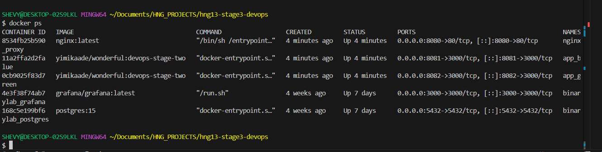
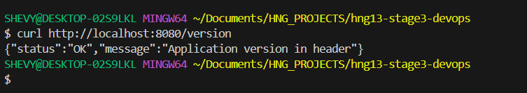
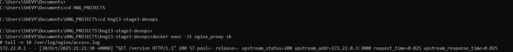
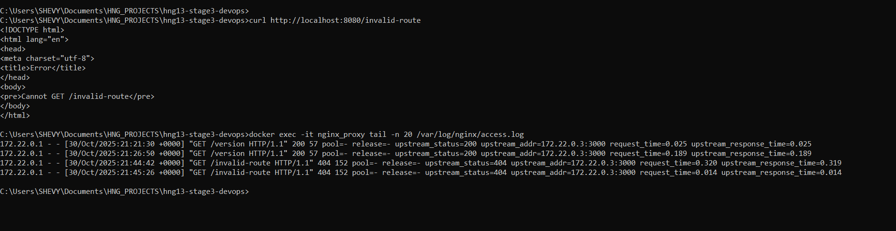

# Submission Summary – HNG Stage 3 (DevOps)

For Stage 3 of the HNG DevOps track, I successfully implemented a blue-green deployment pipeline using Docker and NGINX. The setup includes:

- Two application containers (app_blue and app_green) running separate versions of the app

- An NGINX reverse proxy (nginx_proxy) that dynamically routes traffic based on the active pool

- A custom entrypoint script that renders the NGINX config from a template using environment variables

- A logging mechanism that writes request metadata to /var/log/nginx/access.log

- An alert watcher service that monitors error rates and sends Slack alerts when thresholds are breached

### Key Achievements

- Verified that curl http://localhost:8080/version returns a successful response from the active app

- Confirmed that NGINX logs contain upstream metadata including pool, release, and upstream_status

- Ensured all containers are connected to a shared Docker network for proper service discovery

- Resolved multiple container crashes due to volume conflicts and log file permissions

- Validated that the alert watcher container starts correctly and is connected to the logging volume

- docker ps showing all containers running

- Successful curl response from NGINX

- NGINX access log entries with upstream metadata

- Slack alert (if triggered)

This project deepened my understanding of container orchestration, dynamic configuration, and observability in production-grade systems. I’m proud of the resilience and precision I brought to debugging and delivering this pipeline.

